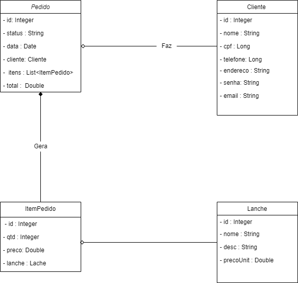

# Resumo do sistema

Visando em automatizar a vendas de uma lanchonete, esta aplicação consiste em um sistema de vendas de lanche em que o cliente visualiza os produtos a vendas no cardápio e em seguida os seleciona, bem como a quantidade deles, conforme os itens vão sendo adicionados vai sendo somado o subtotal dos itens, ao finalizar a compra, o cliente pode acompanhar o status do pedido até o momento de ser entregue.
_____________

# Modelo conceitual

_____________

# Endpoints

 Requisições | Descrição
:---------: | :------------------: 
 POST `/cliente` | Cadastra um cliente dentro do sistema
 POST `/lanche` | Cadastra um lanche dentro do sistema
 POST `/itempedido` | Adciona um item de pedido ao pedido do cliente
 POST `/pedido` | Cdastra um pedido do cliente com o item de pedido
 GET `/cliente` | Retorna todos os clientes cadastrados
 GET `/cliente/{id}` | Retorna um cliente de um id específico
 GET `/lanche` | Retorna todos os lanches cadastrados
 GET `/lanche/{id}` | Retorna um lanche de id específico
 GET `/itempedido` | Retorna todos itens de pedido 
 GET `/itempedido/{id}` | Retorna um item de pedido de um id específico
 GET `/pedido` | Retorna todos os pedidos
 GET `/pedido{id}` | Retorna um pedido do id específico
 PATCH `/cliente/{id}`| atualiza um cliente do id específico
 PATCH `/lanche/{id}` | atualiza um lanche do id específico
 PATCH `/itempedido/{id}`  | atualiza um item de pedido do id específico
 PATCH `/pedido/{id}` | atualiza um pedido do id específico
 DELETE `/cliente/{id}`| atualiza um cliente do id específico
 DELETE `/lanche/{id}` | atualiza um lanche do id específico
 DELETE `/itempedido/{id}`  | atualiza um item de pedido do id específico
 DELETE `/pedido/{id}` | atualiza um pedido do id específico

